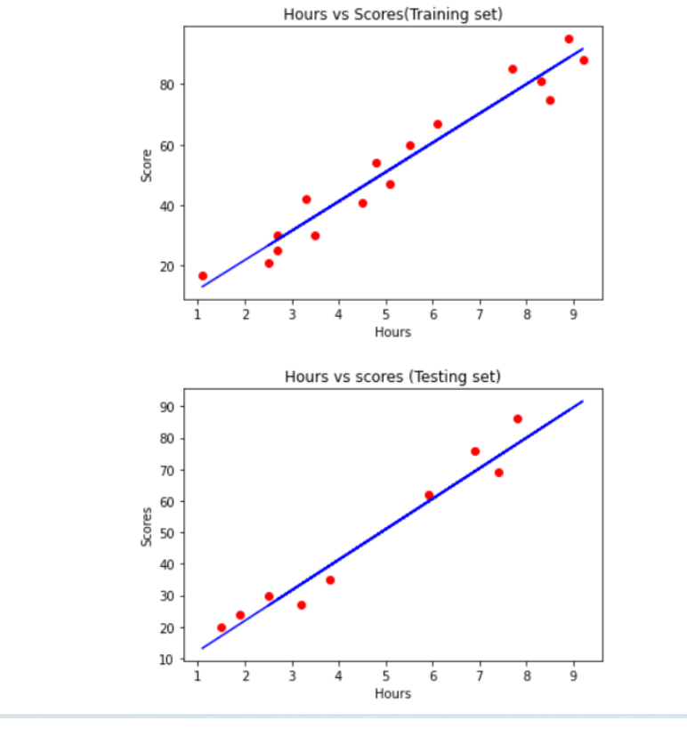

# Implementation-of-Simple-Linear-Regression-Model-for-Predicting-the-Marks-Scored

## AIM:
To write a program to implement the simple linear regression model for predicting the marks scored.

## Equipments Required:
1. Hardware – PCs
2. Anaconda – Python 3.7 Installation / Moodle-Code Runner

## Algorithm
## step1
Import the required Libraries.

## step2
Import the csv file.

## step3
Declare X and Y values with respect to the dataset.

## step4
Plot the graph using the matplotlib library.

## step5
Print the plot.

## step6
End the program.

## Program:
```
~~~
Program to implement the simple linear regression model for predicting the marks scored.
Developed by:A.Sasidharan 
RegisterNumber:212221240049
~~~
import numpy as np
import pandas as pd
import matplotlib.pyplot as plt

dataset = pd.read_csv('student_scores.csv')
dataset.head()
X = dataset.iloc[:,:-1].values
Y = dataset.iloc[:,1].values
from sklearn.model_selection import train_test_split
X_train,X_test,Y_train,Y_test = train_test_split(X,Y,test_size=1/3,random_state=0)
from sklearn.linear_model import LinearRegression
regressor = LinearRegression()
regressor.fit(X_train,Y_train)
Y_pred = regressor.predict(X_test)
plt.scatter(X_train,Y_train,color='red')
plt.plot(X_train,regressor.predict(X_train),color='blue')
plt.title("Hours vs Scores(Training set)")
plt.xlabel("Hours")
plt.ylabel("Score")
plt.show()
plt.scatter(X_test,Y_test,color='red')
plt.plot(X_train,regressor.predict(X_train),color='blue')
plt.title("Hours vs scores (Testing set)")
plt.xlabel("Hours")
plt.ylabel("Scores")
plt.show()
```

## Output:



## Result:
Thus the program to implement the simple linear regression model for predicting the marks scored is written and verified using python programming.
